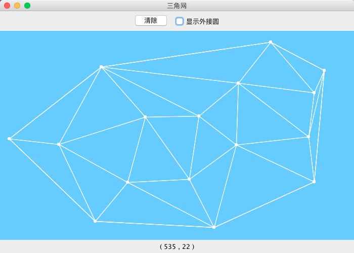

# Delaunay 三角网

## 相关说明
运行效果


效果图

## 运行环境
- Java 1.6 及以上 (实际测试过的环境 Java 1.6, 1.7, 1.8, 10)
- kotlin-stdlib.jar 

```bash
java -jar delaunay.jar
```

## 数据结构

- ArraySet（用于三角形，确保三角形三个点不相同）
   - 添加时进行查重，若重复则不添加。`(Set)`
   - 可按照下标获取。`(Array)`
   - 若使用Java内置的HashSet实际上仍是使用HashMap。无法做到下标取值。
- Graph


## 使用语言 Kotlin

### 语言特性

- 运算符重载（用于下标等）
- 函数扩展(方便调用)
- 高阶函数(map,filter,forEach)，减少使用for循环的情况。